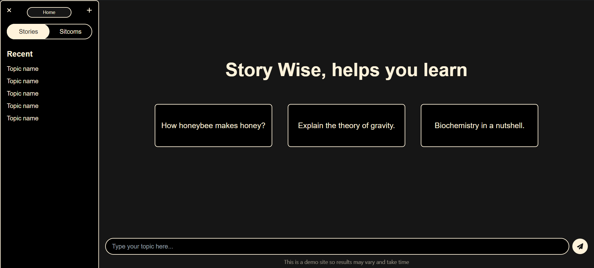

# Story Wise

Story Wise is an innovative platform designed to simplify and enhance the learning process by transforming complex scientific concepts into engaging narratives. Leveraging advanced AI, our platform allows users to input any scientific term or topic and generates captivating stories that explain the concepts in clear, relatable language.

Visit the live site: [Story Wise](https://story-wise.netlify.app)

## Table of Contents

- [General Information](#general-information)
- [Screenshots](#screenshots)
- [Frontend Setup](#frontend-setup)
- [Backend Setup](#backend-setup)
- [Features](#features)
- [Technologies Used](#technologies-used)

## General Information

Story Wise aims to revolutionize education by making learning more intuitive, engaging, and accessible. Whether you're a student struggling with a difficult subject, a curious mind exploring new frontiers, or someone who loves a good story, Story Wise offers a unique way to understand science through storytelling.

## Screenshots

### Home Page

### Generate Story

### Story Result

## Frontend Setup

Read the [frontend README](./frontend/README.md) for instructions on setting up the frontend.

## Backend Setup

Read the [backend README](./backend/README.md) for instructions on setting up the backend.

## Features

- **Generate Stories:** Users input their topic and receive generated stories for better understanding.
- **Generate Sitcom Scripts:** Users input their topic and receive generated sitcom scripts for better understanding.
- **Story Collection:** Sample stories and sitcom scripts are available for users to explore. Creative users can also add their own stories to the collection.

## Technologies Used

- **Frontend:**
  - React
  - TypeScript
  - Vite
  - Tailwind CSS
  - DaisyUI

- **Backend:**
  - Django
  - Django REST framework
  - AI71